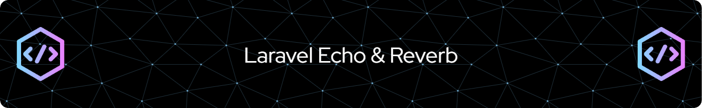

# Laravel Reverb Setup
Setting up Laravel Reverb can be a nuisance but it doesn't have to be. This repository can show you a few ways to setup the reverb. 

## Setting Up Reverb
- Usually start with `php artisan install:broadcasting`
- Now you have configuration detail in your .env and broadcast config
- But you also have channel.php under routes which is very important. It indicates which channel can go through.

## How project was setup
### Reverb.Server
This is the Main reverb server. You could potentially setup a reverb server on this project, while also subscribe for a broadcast event in here as well using Laravel built-in front end.
#### This project has done as follow:
- Has setup Reverb
- Created a `SimpleEvent` for public channel (tested)
- Created a `PrivateEvent` for private channel (not-tested)
- Add the public channel route to `channel.php`
- Use `php artisan reverb:start` to start your Reverb server

### Reverb.Backend
You want your environment to have a centralized Laravel Reverb server, so this backend you also setup Laravel Reverb but for the configuration you just copy from the Reverb.Server, and you don't have to start Reverb here.
#### This project has done as follow:
- Has setup Reverb
- Copy the configuration from Reverb.Server
- Create an event for sending notification to the public channel
- Add the public channel route to `channel.php`

### Reverb.Client
In Nuxt3 client we use a module called `nuxt-laravel-echo` which is a wrapper around Laravel Echo and Pusher. This client can also get notification from our Reverb.Server.
#### This project has done as follow:
- Install Nuxt 3
- Install `nuxt-laravel-echo`
- Configure echo in the nuxt.config.ts
- Use the echo in App.vue

## Testing
- Ideally copy these project to Laravel Herd root
- Inside Reverb.Server:
  - Start reverb server on Reverb.Server
  - Visit reverb.server.test to and check console to see the client getting notification
  - Use `php artisan tinker` to dispatch the SimpleEvent like so `App\Events\SimpleEvent::dispatch()`
  - On another terminal use `php artisan queue:work` (yes, you need queue so your notification won't interfere with application)
  - You should see the "Hello World" in the frontend console
- Inside Reverb.Backend:
  - Use `php artisan tinker` to dispatch the `App\Events\AnotherPublicEvent::dispatch();` event 
  - On another terminal use `php artisan queue:work`
- Go back to Reverb.Server frontend you should see `Just a public notification!` in the console
- Inside Reverb.Client
  - Run `yarn dev` to see the client frontend
  - Open up console, and wait to see the message
- Next run the dispatch on both Reverb.Server and Reverb.Backend, you should see both messages on both of the frontends (Nuxt, Laravel)

_Tips: after updating code on, if it doesn't reflect what you changed, make sure you clean caches and restart the `queue:work` `reverb:start`_

_________________

By the way, a coffee would help

